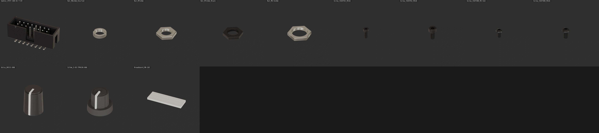

# protorack-kicad

The protorack-kicad component library contains all the custom symbols, footprints and 3D models
we use for developing eurorack modules. All the footprints are designed carefully, either to
the manufacturers exact specifications or to guarantee a tight friction fit (mostly for headers
and some other through-hole components).

Every footprint also comes with a high quality 3D model which can be used for visualization
purposes (especially in combination with [pcb2blender](https://github.com/30350n/pcb2blender)),
but also to check for possible issues with components overlapping.
(If you want to learn more about how the 3D models are created, checkout
[my other projects](#other-projects)).

## Installation

...

## Other Projects

- The [pcb2blender](https://github.com/30350n/pcb2blender) workflow lets you create
  professionally looking product renders of all your KiCad projects in minutes! Simply export
  your board as a `.pcb3d` file in KiCad, import it into Blender and start creating!

- The free2ki [FreeCAD](https://github.com/FreeCAD/FreeCAD) workbench enables you to apply
  materials to 3D models in FreeCAD, as well as to easily export them to VRML (`.wrl`) files,
  with correctly applied rotation and scaling, for use in KiCad as well as Blender.

## Credits

...

## License

- This project is licensed under
  [GPLv3](https://github.com/30350n/pcb2blender/blob/master/LICENSE).
